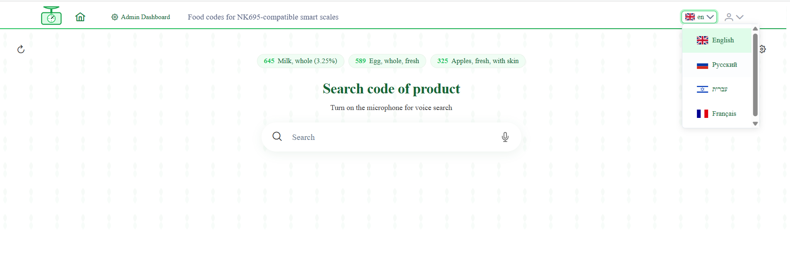
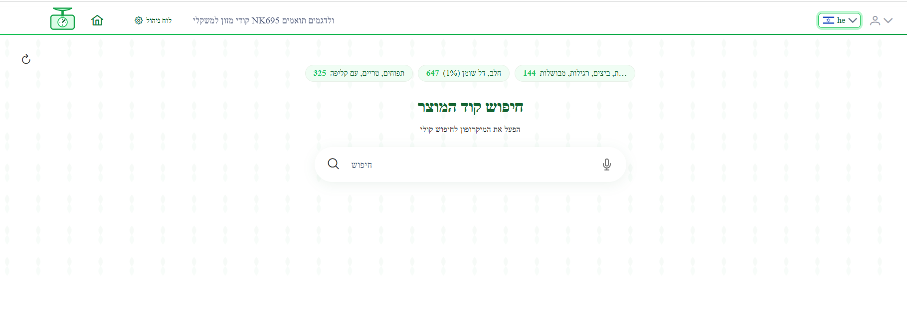
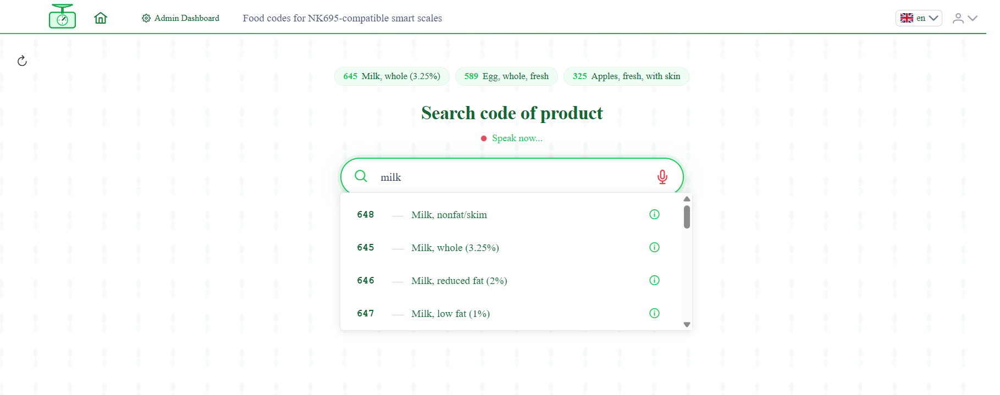
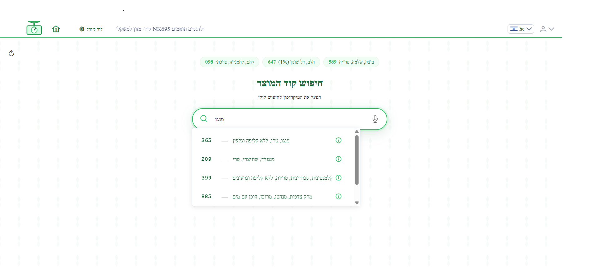
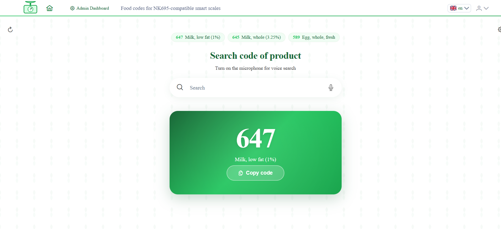
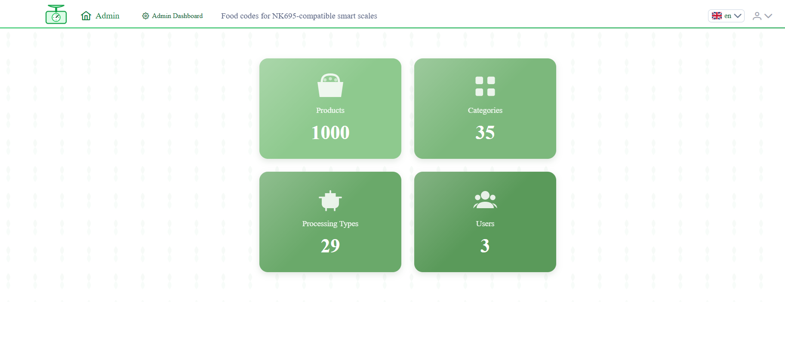

# KitchenScaleCode Voice (KSC Voice)

## 📖 About

**KitchenScaleCode Voice (KSC Voice)**

KitchenScaleCode Voice (KSC Voice) is a web application that allows users to quickly find product codes for smart kitchen scales using voice input. Instead of manually scrolling through a booklet of 1000+ product codes, users can simply say the product name and instantly get the corresponding scale code.

**The Problem:** The original manufacturer booklet lists 1000+ products **only in English**, making it difficult for non-English speakers to find codes for everyday items like "Яблоки" or "תפוחים". This creates a significant barrier for users who are not fluent in English or simply prefer to interact in their native language.

For smart kitchen scales specifically, this becomes a practical problem in everyday usage, not just a language limitation.

**The Solution:** KSC Voice supports **4 languages** (EN, RU, HE, FR) with native voice recognition. Speak naturally in your language — get the code instantly. No language barriers, no manual scrolling.

**Extensibility:** The application is architected for easy language expansion. New languages can be added **without code changes** — simply by updating the configuration file and adding translations. This design allows the project to scale to any number of languages without redeployment.

This project was built as a personal pet project to explore voice recognition technologies and their practical application in real-world kitchen workflows.

---

## ⚙️ How It Works

```text
User speaks: "Apple"
        ↓
Voice recognition converts speech to text
        ↓
App performs fuzzy search in the product database
        ↓
Result: Apples, fresh, with skin — Scale Code: 325
```
---

## 🏗️ Architecture Highlights

This project is built as a full-stack Supabase-powered application with a strong focus on:

- Secure row-level data access (RLS policies)
- Server-side fuzzy search using PostgreSQL pg_trgm
- Multilingual data architecture (EN / RU / HE / FR)
- Role-based data exposure (admin vs user)
- RPC-based search layer for performance and control
- Web Speech API integration for voice-driven UX

 ## ✨ Core Features

- 🎙️ Voice Search — hands-free product lookup
- ⌨️ Text Search — fallback manual search
- ⚡ Fast Results — sub-second fuzzy matching
- 🌍 Multilingual UI (EN, RU, HE, FR)
- 📋 Copy-to-clipboard product codes

## 🔐 Admin Features

- Product management dashboard
- Category and processing configuration
- Search tuning via database parameters
- Controlled data exposure via roles

## 🚀 Advanced Features

- PostgreSQL fuzzy search (pg_trgm)
- Server-side normalization of queries
- Confidence-based ranking algorithm
- Language-aware search matching
  
## 🛠️ Tech Stack

| Layer | Technology | Purpose |
|:---|:---|:---|
| **Frontend** | Angular 20.3.8 | SPA framework |
| **UI Components** | PrimeNG | UI component library |
| **Styling** | SCSS | Custom styles & theming |
| **Voice Input** | Web Speech API | Speech-to-text recognition |
| **Database** | Supabase (PostgreSQL) | Data storage & REST API |
| **Search** | PostgreSQL pg_trgm | Fuzzy text matching |
| **Auth** | Supabase Auth | User authentication |
| **Deployment** | GitHub Pages | Static hosting |


## 🎬 Demo

### Live Demo
🔗 **[Try it here](https://alg5.github.io/search-code-by-speech/)**

### Video Demo
🎥 **[Watch on YouTube](YOUR_YOUTUBE_LINK_HERE)** *(optional)*


## Screenshots
### Home Page (English)


### Home Page (Hebrew)


### Voice Search Active


### Voice Search Active (Hebrew)



### Search Result


### Admin Dashboard



## Future Improvements

- 🌍 **Multi-language voice support** — migrate to Transloco library for scalable i18n  
- 🔵 **Bluetooth integration** — send code directly to scale  
- 📱 **PWA** — install as mobile app  

## Author
Anna Gubanov

## ⚖️ Legal Notice
This project is an unofficial, non-commercial tool created for educational and portfolio purposes.
Scale product codes are functional/technical data used solely for device interoperability with NK695-compatible kitchen scales.
Product names and codes are sourced from publicly available documentation. This project is not affiliated with, endorsed by, or sponsored by the scale manufacturer.
Nutritional data is provided by the USDA FoodData Central API.
All trademarks and product names belong to their respective owners

## License
Copyright (c) 2026 Anna Gubanov
This project is publicly available for viewing and educational purposes only.
You may not use, copy, modify, merge, publish, distribute, sublicense, or sell
any part of this code without explicit written permission.
This project is intended as a portfolio piece and may be integrated into a
commercial product in the future.

## 👤 Contact
[Anna Gubanov]  
💼 LinkedIn: [Anna Gubanov](https://www.linkedin.com/in/anna-gubanov)  
🐙 GitHub: https://github.com/alg5
📧 Email: anna.gubanov1@gmail.com  


## Getting Started

```bash
# Clone repository
git clone https://github.com/alg5/search-code-by-speech.git

# Install dependencies
npm install

# Set up environment
cp src/environments/environment.example.ts src/environments/environment.ts
# Add your Supabase credentials

# Run development server
ng serve

